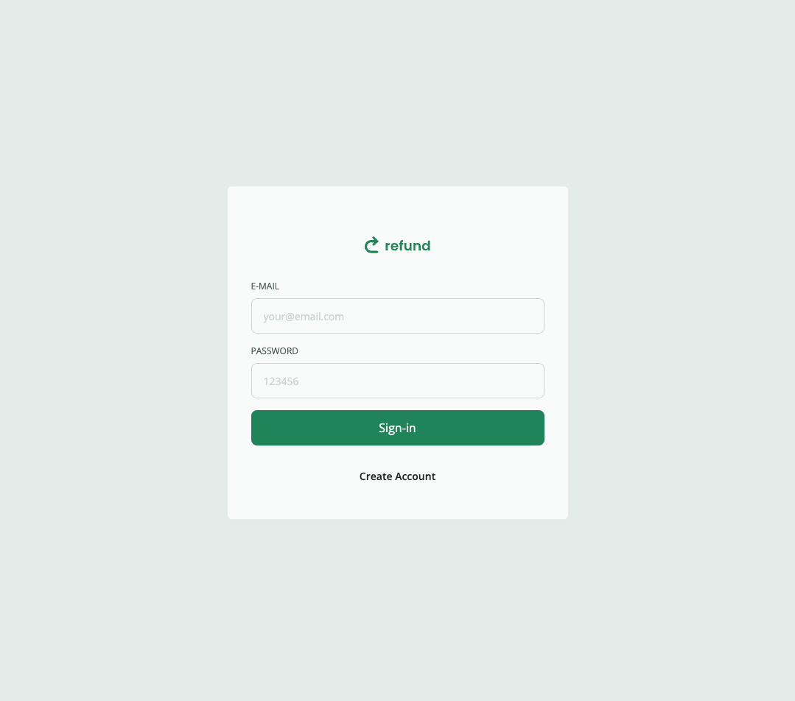
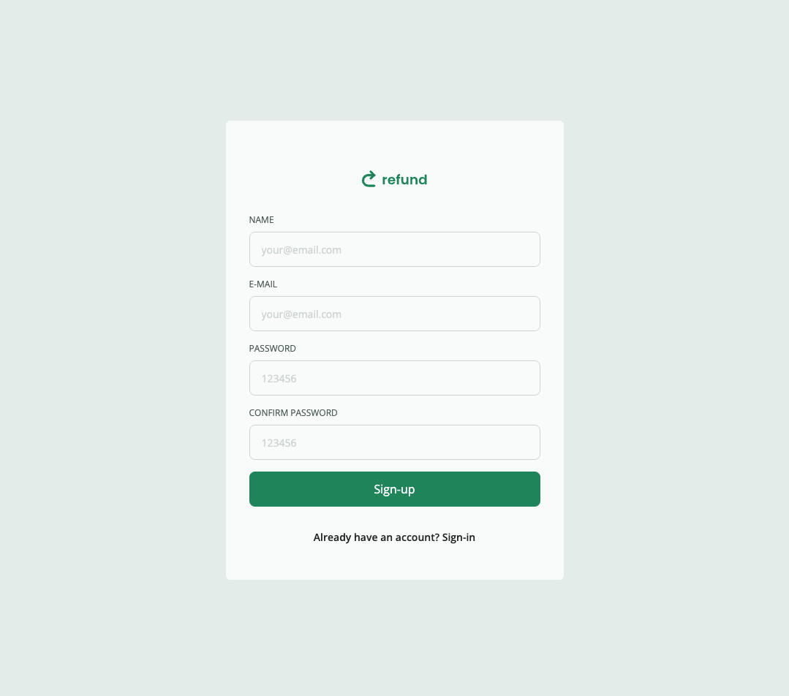
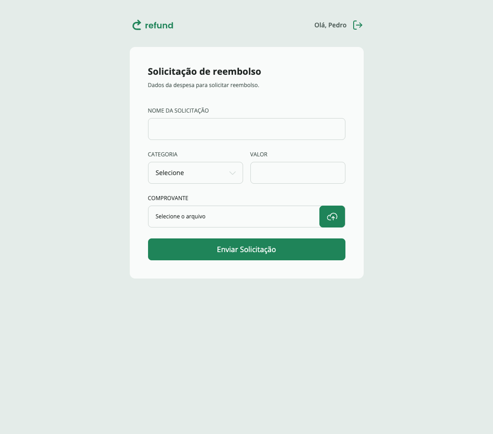
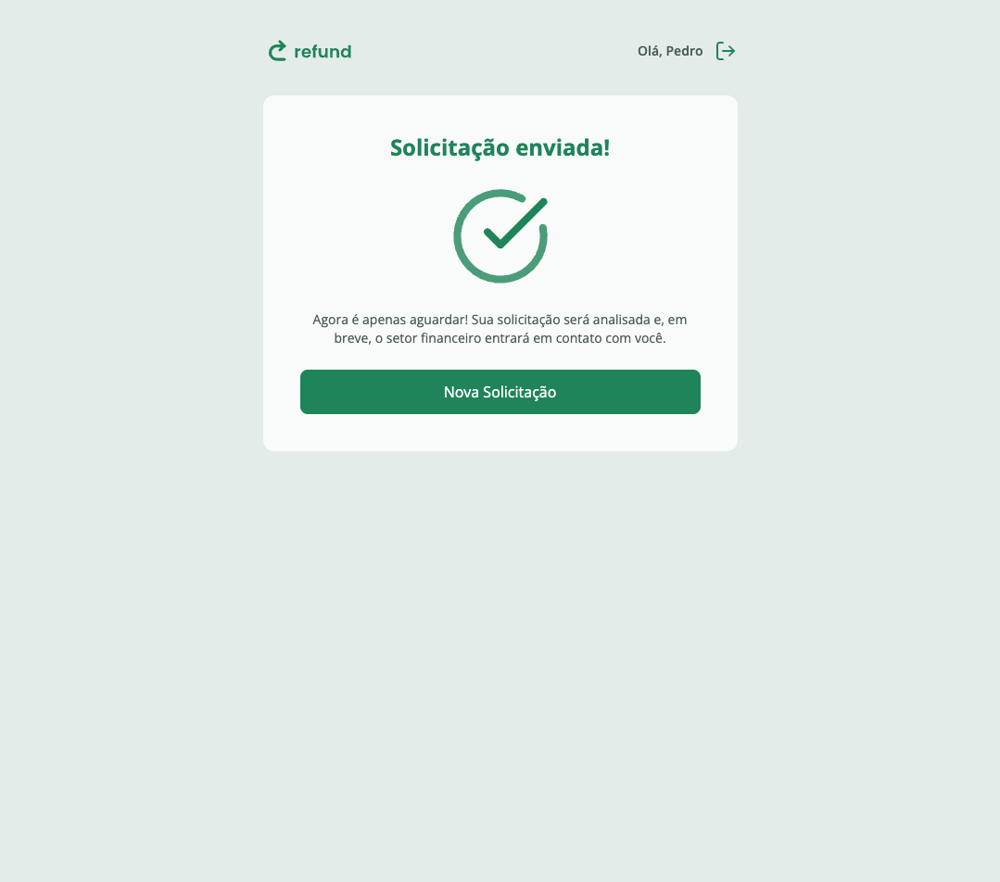
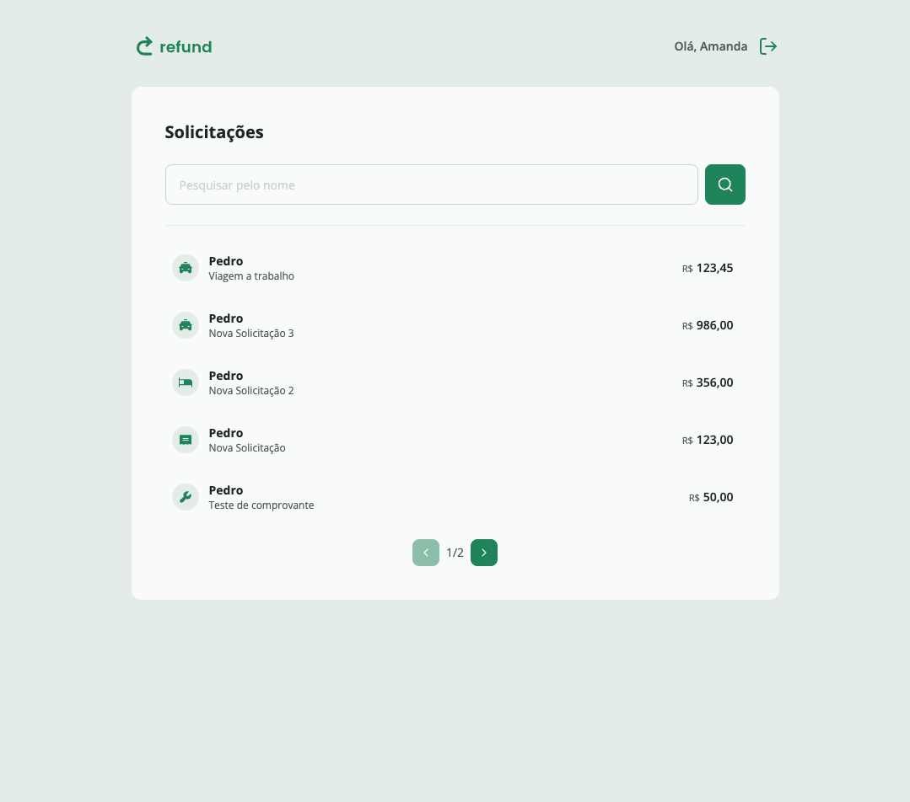
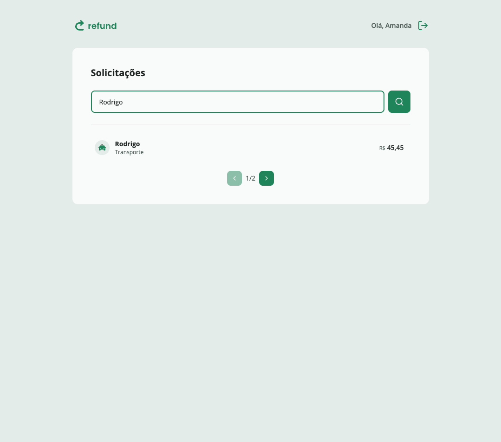
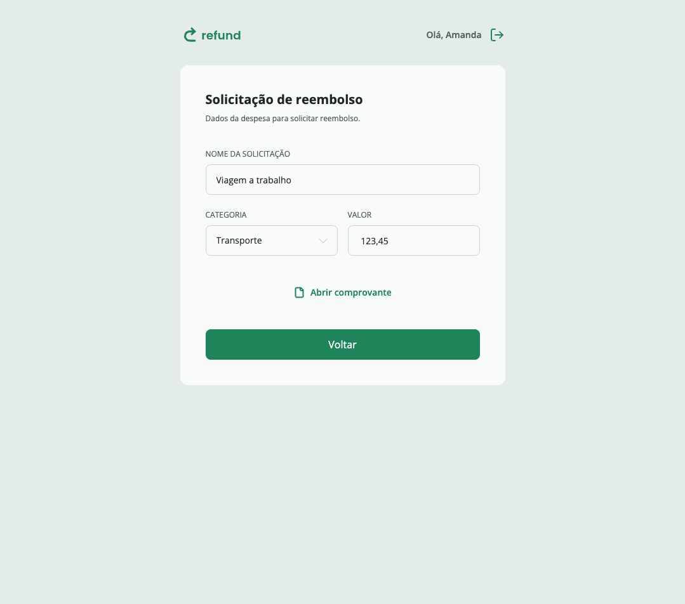

# 💳 Refund Platform

A SaaS platform designed to **automate, manage, and track refunds** for digital products, subscriptions, and online services, providing transparency, compliance, and operational efficiency for businesses.

> Example use cases:
>
> - Subscription cancellations and prorated refunds
> - Refund workflows for digital marketplaces
> - Financial and operational reporting for refund operations

---

## 📌 Table of Contents

- [Overview](#-overview)
- [Key Features](#-key-features)
- [Screenshots](#-screenshots)
- [Tech Stack](#-tech-stack)
- [License](#-license)

---

## 📖 Overview

**Refund Platform** centralizes refund operations into a single system, enabling companies to:

- Reduce manual refund handling
- Improve customer experience
- Ensure financial accuracy and compliance
- Gain visibility into refund metrics and trends

The platform is designed with **scalability, security, and observability** in mind, making it suitable for startups and enterprise environments.

---

## ✨ Key Features

- ✅ Refund request management
- ✅ Automated refund workflows
- ✅ Approval and rejection flows
- ✅ Partial and prorated refunds
- ✅ Refund status tracking
- ✅ Audit logs and compliance reports
- ✅ Role-based access control (RBAC)
- ✅ Real-time dashboards and analytics

---

## 🖥️ Screenshots

### Login Screen

  

---

### Sign-up Screen

  

---

### Employee - Refund Dashboard

  

---

### Employee - Refund Confirmation

  

---

### Manager - Refund Dashboard

  

---

### Manager - Refund Dashboard Filter

  

---

### Manager - Refund Details

  

---

## 🛠️ Tech Stack

### Frontend

- React
- TypeScript
- Tailwind CSS

---

## 📄 License

This project is licensed for **portfolio and educational purposes only**.

### Terms

- ❌ Commercial use is **strictly prohibited**
- ❌ Selling, sublicensing, or monetizing this project or its derivatives is **not allowed**
- ❌ Using this project in production environments is **not permitted**
- ✅ Viewing, cloning, and studying the code for learning purposes is allowed
- ✅ Showcasing this project as part of a personal or professional portfolio is allowed

### Copyright

Copyright © 2026 Pedro Campos. All rights reserved.

### Disclaimer

This software is provided **"as is"**, without warranty of any kind, express or implied.  
The author is not liable for any damages arising from the use of this software.

If you are interested in commercial licensing or collaboration, please contact the author.
